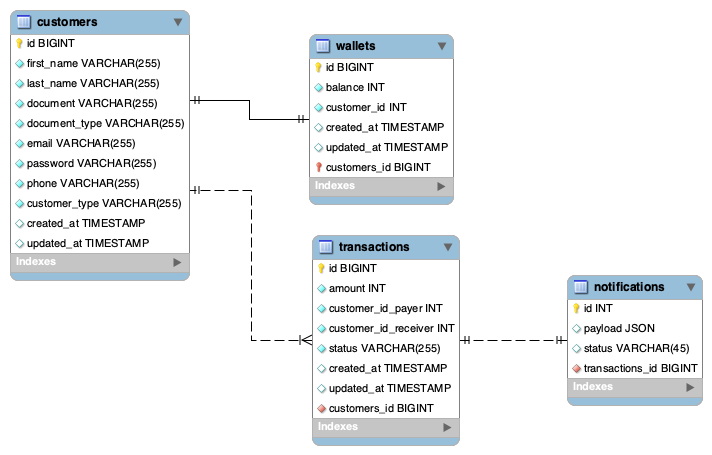

# Sistema de Pagamento Simples
API responsavel por gerir transaferencias monetarias entre clientes

# Modelagem de dados


# Configurando o projeto
Crie o Arquivo .env
```sh
cp .env.example .env
```

Atualize as variáveis de ambiente do arquivo .env
```dosini
APP_NAME="service-payment-simplified"
APP_URL=http://localhost:11074

DB_CONNECTION=mysql
DB_HOST=db
DB_PORT=3306
DB_DATABASE=service-payment-simplified-db
DB_USERNAME=root
DB_PASSWORD=root

CACHE_DRIVER=redis
QUEUE_CONNECTION=redis
SESSION_DRIVER=redis

REDIS_HOST=redis
REDIS_PASSWORD=null
REDIS_PORT=6379

# Docker
# run: id -u to show your user id
DOCKER_USER=501
DOCKER_GROUP=1000
```

Suba os containers do projeto
```sh
docker-compose up -d
```


Acessar o container
```sh
docker-compose exec app bash
```


Instalar as dependências do projeto
```sh
composer install
```


Gerar a key do projeto Laravel
```sh
php artisan key:generate
```


Acessar o projeto
[http://localhost:11074](http://localhost:11074)